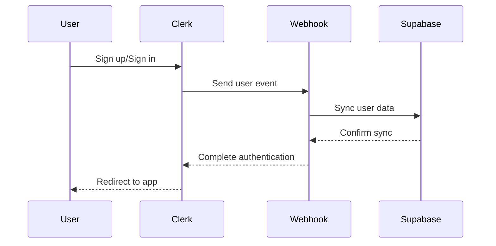

# Car Search Homepage Documentation

## Overview
The Car Search homepage is a modern, responsive web application built with Next.js and TypeScript. It features a clean, minimalist design with a full-screen hero section and an intelligent search interface that connects to an AI agent for personalized car recommendations.

## Authentication & Data Management

### 1. Authentication Architecture
The application uses a dual-system architecture combining Clerk for authentication and Supabase for data storage:



### 2. Data Structure

#### Clerk User Data
```typescript
{
  id: string;          // Clerk's user ID
  emailAddresses: [];  // User's email(s)
  // ... other Clerk data
}
```

#### Supabase User Schema
```sql
create table public.users (
    id uuid default gen_random_uuid() primary key,
    clerk_id text unique not null,
    email text unique not null,
    created_at timestamp with time zone default timezone('utc'::text, now()) not null,
    updated_at timestamp with time zone default timezone('utc'::text, now()) not null
);
```

### 3. Security Implementation

#### Row Level Security (RLS)
```sql
-- Enable RLS
alter table public.users enable row level security;

-- User access policy
create policy "Users can view their own data" 
    on public.users
    for select 
    using (auth.uid()::text = clerk_id);

-- Admin access policy
create policy "Service role can manage all users" 
    on public.users
    using (auth.jwt()->>'role' = 'service_role');
```

#### Route Protection
```typescript
// middleware.ts
const publicRoutes = [
  "/",              // Homepage
  "/discover",      // Discovery page
  "/search",        // Search results
  "/api/search",    // Search API
];

const ignoredRoutes = [
  "/api/auth/webhook",  // Clerk webhook
  "/_next",            // Next.js assets
  "/favicon.ico",      // Favicon
];
```

### 4. Integration Components

#### Type Definitions (types/user.ts)
```typescript
interface SupabaseUser {
  id: string;
  clerk_id: string;
  email: string;
  created_at: string;
  updated_at: string;
}

interface ExtendedUser extends User {
  supabaseData?: SupabaseUser;
}

interface UserProfile extends SupabaseUser {
  // Additional user profile fields
}
```

#### Utility Functions (lib/supabase-utils.ts)
```typescript
// Get current user's data
async function getCurrentUserData(): Promise<SupabaseUser | null>

// Get user by Clerk ID
async function getUserByClerkId(clerkId: string): Promise<SupabaseUser | null>

// Get user by email
async function getUserByEmail(email: string): Promise<SupabaseUser | null>
```

### 5. Environment Configuration

```env
# Clerk Authentication
NEXT_PUBLIC_CLERK_PUBLISHABLE_KEY=pk_***
CLERK_SECRET_KEY=sk_***
CLERK_WEBHOOK_SECRET=whsec_***

# Supabase Configuration
NEXT_PUBLIC_SUPABASE_URL=https://***
NEXT_PUBLIC_SUPABASE_ANON_KEY=eyJ***
SUPABASE_SERVICE_ROLE_KEY=eyJ***

# Search API
NEXT_PUBLIC_AGENT_TOKEN=***
```

### 6. Webhook Implementation

The webhook handler (/api/auth/webhook/route.ts) manages user synchronization:

1. **Event Reception**:
   - Receives Clerk user events
   - Verifies webhook signature
   - Extracts user data

2. **Data Synchronization**:
   - Checks for existing user
   - Creates or updates Supabase record
   - Handles errors and logging

3. **Security Measures**:
   - Validates webhook signatures
   - Uses service role for Supabase operations
   - Implements error handling

## UI Implementation

### 1. Theme Configuration
```typescript
const theme = {
  colors: {
    background: '#0a0a0a',
    primary: '#3b82f6',
    primaryHover: '#2563eb',
    secondary: '#1e293b',
    border: '#334155',
    textSecondary: '#94a3b8',
  },
  effects: {
    glass: 'backdrop-blur-lg bg-secondary/70',
    gradient: 'bg-gradient-to-r from-primary to-primaryHover',
  }
}
```

### 2. Component Styling
```typescript
// Clerk Components
appearance={{
  baseTheme: {
    variables: {
      colorBackground: '#0a0a0a',
      colorInputBackground: '#1e293b',
      colorInputText: '#ffffff',
      colorText: '#ffffff',
      colorTextSecondary: '#94a3b8',
      colorPrimary: '#3b82f6',
    }
  }
}}
```

## Search Flow Implementation

### 1. Homepage Search Form (`components/search-form.tsx`)
```typescript
Key Features:
- Multi-step form with progressive disclosure
- Immediate response on search submission
- URL-based parameter handling
- Session management with UUID

Flow:
1. User fills out search parameters across steps
2. On submission:
   - Generates unique sessionId
   - Collects all selected parameters
   - Constructs search URL with parameters
   - Immediate navigation to results page
```

### 2. Search Results Page (`app/search/page.tsx`)
```typescript
Implementation:
- Immediate display of search parameters as badges
- Asynchronous webhook call to AI agent - n8n
- Real-time loading states
- Error handling with user feedback

Components:
1. Parameter Badges:
   - Display selected search criteria
   - Clean, pill-style design
   - Grouped by parameter type

2. Chat Interface:
   - Shows user query
   - Displays AI response
   - Loading indicators
   - Error handling
```

## API Integration

### 1. Clerk Webhook (`/api/auth/webhook`)
```typescript
Endpoint: POST /api/auth/webhook

Headers:
- svix-id
- svix-timestamp
- svix-signature

Events Handled:
- user.created
- user.updated

Implementation:
- Async webhook handler
- Signature verification
- Supabase sync
- Error handling
```

### 2. Search Webhook
```typescript
Endpoint: POST https://n8n.yotor.co/webhook/invoke_agent

Headers:
{
  'Authorization': `Bearer ${NEXT_PUBLIC_AGENT_TOKEN}`,
  'Content-Type': 'application/json',
  'Accept': 'application/json'
}

Payload:
{
  sessionId: string;
  chatInput: string;
  carSpecs: {
    make?: string;
    model?: string;
    year?: number;
    county?: string;
    features?: string[];
    usage?: string;
    minPrice?: number;
    maxPrice?: number;
  }
}
```

## API Routes

```typescript
// Public Routes
- / (Homepage)
- /discover (Discovery page)
- /search (Search results)
- /api/search (Search API)

// Protected Routes
- /api/auth/* (Auth endpoints)
- /api/user/* (User data endpoints)

// Webhook Routes
- /api/auth/webhook (Clerk webhook)
```

## Development Guidelines

1. **Authentication**:
   - Use Clerk components for auth UI
   - Implement proper route protection
   - Handle auth state changes

2. **Data Management**:
   - Use Supabase for user data storage
   - Implement proper error handling
   - Follow type definitions

3. **Security**:
   - Use environment variables
   - Implement proper RLS policies
   - Validate webhook signatures

4. **Styling**:
   - Follow theme configuration
   - Use glass morphism effects
   - Maintain responsive design

## Environment Variables
```env
# Clerk Authentication
NEXT_PUBLIC_CLERK_PUBLISHABLE_KEY=pk_***
CLERK_SECRET_KEY=sk_***
CLERK_WEBHOOK_SECRET=whsec_***

# Supabase Configuration
NEXT_PUBLIC_SUPABASE_URL=https://***
NEXT_PUBLIC_SUPABASE_ANON_KEY=eyJ***
SUPABASE_SERVICE_ROLE_KEY=eyJ***

# Search API
NEXT_PUBLIC_AGENT_TOKEN=***
```

## Styling
The application uses a modern, dark theme inspired by Clerk's design:

```css
Colors:
- Background: #0a0a0a
- Primary: #3b82f6
- Primary Hover: #2563eb
- Secondary: #1e293b
- Border: #334155
- Text Secondary: #94a3b8

Features:
- Glass morphism effects
- Grid background patterns
- Gradient text
- Modern scrollbar styling
- Smooth transitions
```

## Routes
```typescript
Pages:
- / (Homepage)
- /search (Search results)
- /discover (Discovery page)

API Routes:
- /api/auth/webhook (Clerk webhook)
```

## Webhook Integration Details

### Endpoint
```
POST https://n8n.yotor.co/webhook/invoke_agent
```

### Authentication
```typescript
Headers: {
  'Authorization': `Bearer ${NEXT_PUBLIC_AGENT_TOKEN}`,
  'Content-Type': 'application/json',
  'Accept': 'application/json'
}
```

### Payload Structure
```typescript
interface WebhookPayload {
  // Unique identifier for the search session
  sessionId: string;  // Generated using uuidv4()
  
  // Raw concatenated string of user selections
  chatInput: string; // Example: "bmw dublin 2020"
  
  // Structured car specifications
  carSpecs: {
    // Make of the car (optional)
    make?: string;    // Example: "bmw"
    
    // Model of the car (optional)
    model?: string;   // Example: "3 Series"
    
    // Year of the car (optional)
    year?: number;    // Example: 2020
    
    // Location/County (optional)
    county?: string;  // Example: "dublin"
    
    // Array of selected features (optional)
    features?: string[];  // Example: ["leather", "sunroof"]
    
    // Usage type (optional)
    usage?: string;   // Example: "family"
    
    // Price range (optional)
    minPrice?: number;  // Example: 20000
    maxPrice?: number;  // Example: 50000
  }
}
```

### Example Payload
```json
{
  "sessionId": "5dee4b50-914d-4ad7-b174-cd14ce906efa",
  "chatInput": "bmw 3 Series dublin 2020",
  "carSpecs": {
    "make": "bmw",
    "model": "3 Series",
    "year": 2020,
    "county": "dublin",
    "features": ["leather", "navigation"],
    "minPrice": 25000,
    "maxPrice": 45000
  }
}
```

### Response Structure
```typescript
interface WebhookResponse {
  // Main response message from the AI agent
  message: string;
  
  // Optional array of car listings
  listings?: Array<{
    title: string;
    price: number;
    year: number;
    location: string;
    url: string;
  }>;
  
  // Optional array of information sources
  sources?: Array<{
    title: string;
    url: string;
  }>;
}
```

### Example Response
```json
{
  "message": "Based on your preferences, I've found several BMW 3 Series models in Dublin...",
  "listings": [
    {
      "title": "2020 BMW 3 Series 320d M Sport",
      "price": 35000,
      "year": 2020,
      "location": "Dublin",
      "url": "https://example.com/listing/123"
    }
  ],
  "sources": [
    {
      "title": "BMW Ireland Official Site",
      "url": "https://www.bmw.ie"
    }
  ]
}
```

### Error Handling
```typescript
try {
  const response = await invokeSearchAgent(payload);
  // Handle success
} catch (error) {
  // Error types:
  // - Network errors
  // - Authentication errors (401)
  // - Rate limiting (429)
  // - Server errors (500)
  console.error('Webhook error:', error);
  // Display user-friendly error message
}
```

## User Experience Flow

1. **Homepage Selection**
   - User selects car parameters
   - Multi-step form guides through options
   - Clear visual feedback on selections

2. **Search Initiation**
   - User clicks search button
   - Immediate response - no waiting
   - Smooth transition to results page

3. **Results Page**
   - Instant display of selected parameters as badges
   - Clear loading state while waiting for AI
   - Progressive loading of AI response
   - Error handling with user-friendly messages

4. **AI Integration**
   - Background processing of search request
   - Real-time updates in chat interface
   - Contextual responses based on parameters
   - Follow-up capability for refinements

## Implementation Benefits

1. **Performance**
   - Immediate user feedback
   - No blocking operations
   - Smooth transitions between pages
   - Optimized loading states

2. **User Experience**
   - Clear visual feedback
   - Progressive disclosure
   - Intuitive parameter display
   - Transparent processing status

3. **Technical Architecture**
   - Clean separation of concerns
   - URL-based state management
   - Robust error handling
   - Maintainable component structure

## Layout Structure

### Root Layout (`app/layout.tsx`)
```typescript
- Main container with flex layout
- Side Panel (collapsible)
- Content area (flex-1)
```

### Side Panel Component
```typescript
Location: components/side-panel.tsx
Width: 
- Expanded: w-48 (192px)
- Collapsed: w-12 (48px)

Features:
- Transparent background (bg-transparent when collapsed)
- Semi-transparent black (bg-black/20) when expanded
- Subtle blur effect (backdrop-blur-[2px])
- Animated transitions
- Responsive icons and text
```

#### Side Panel Sections:
1. **Header**
   - Logo (always visible)
   - Toggle button
   - Transition animations

2. **Navigation Links**
   - Home
   - Discover
   - Fade-in animations for text

3. **Recent Searches**
   - Only visible when expanded
   - Fade-in animation
   - Truncated text

4. **Authentication Buttons**
   - Sign in
   - Sign up
   - Ghost variant with hover effects

## Homepage Components

### 1. Hero Section
```typescript
Location: app/page.tsx

Features:
- Full-screen height (h-screen)
- Background image with gradient overlay
- Centered content layout
- Responsive text sizing
```

#### Hero Content:
```typescript
- Title: "Find Your Perfect Car"
- Subtitle: AI assistance message
- Search Form Component
```

### 2. Search Form Component
```typescript
Location: components/search-form.tsx

Structure:
- Multi-step form
- Progressive disclosure
- Responsive grid layout
```

#### Form Steps:
1. **Basic Search**
   ```typescript
   Fields:
   - Make (Select)
   - Model (Select - dynamic based on make)
   - Price Range (Min/Max)
   - Year Range (Min/Max)
   - Location
   ```

2. **Advanced Options**
   ```typescript
   Fields:
   - Features (Multiple select)
   - Usage Type
   - Additional Preferences
   ```

#### Car Data Structure:
```typescript
const carModels = {
  volkswagen: ["Golf", "Passat", "Tiguan", ...],
  toyota: ["Corolla", "RAV4", "Camry", ...],
  // ... other makes and models
}
```

### 3. Suggestions Section
```typescript
Location: app/page.tsx

Features:
- Grid layout (1 column mobile, 3 columns desktop)
- Clickable cards with hover effects
- Dynamic routing on click
```

#### Suggestion Items:
```typescript
const suggestions = [
  { text: "Popular used cars under €15,000", query: "..." },
  { text: "Best family SUVs", query: "..." },
  // ... more suggestions
]
```

## Styling and Animations

### Theme Configuration
```typescript
Location: tailwind.config.js

Animations:
keyframes: {
  fadeIn: {
    '0%': { opacity: '0' },
    '100%': { opacity: '1' }
  }
}
```

### Color Scheme
```typescript
- Text: white with varying opacity (90%, 70%, 50%)
- Backgrounds: transparent to semi-transparent black
- Accents: blue-500 with opacity
- Borders: white with 5% opacity
```

### Responsive Design
```typescript
- Mobile-first approach
- Breakpoints:
  - md: 768px (grid changes)
  - lg: 1024px (layout adjustments)
```

## State Management

### Form State
```typescript
const [formData, setFormData] = useState({
  make: "",
  model: "",
  minPrice: "",
  maxPrice: "",
  minYear: "",
  maxYear: "",
  features: [],
  usage: "",
  location: ""
});
```

### Navigation State
```typescript
- Side panel expansion state
- Form step state
- Authentication state
```

## Routing and Navigation

### Route Structure
```typescript
- / (Homepage)
- /search (Search results)
- /discover (Discovery page)
```

### Navigation Handling
```typescript
const handleSuggestionClick = (query: string) => {
  const sessionId = uuidv4();
  router.push(`/search?sessionId=${sessionId}&chatInput=${query}`);
};
```

## Performance Optimizations

### Image Optimization
```typescript
- Next.js Image component with priority loading
- Responsive image sizing
- Blur placeholder support
```

### Component Loading
```typescript
- Client-side components marked with 'use client'
- Optimized bundle splitting
- Lazy loading for non-critical components
```

## Security Considerations

### Authentication
```typescript
- Secure authentication flow
- Protected routes
- Token management
```

### Form Validation
```typescript
- Input sanitization
- Type checking
- Error handling
```

## Component Dependencies

### Required Packages
```json
{
  "next": "latest",
  "react": "^18",
  "react-dom": "^18",
  "typescript": "^5",
  "tailwindcss": "^3",
  "lucide-react": "latest",
  "uuid": "^9",
  "@radix-ui/react-select": "latest",
  "@radix-ui/react-dialog": "latest"
}
```

### UI Components
- Button (components/ui/button)
- Input (components/ui/input)
- Select (components/ui/select)
- Dialog (components/ui/dialog)

### Custom Components
- AIAssistant (components/ai-assistant)
- SearchForm (components/search-form)
- SidePanel (components/side-panel)
- AuthPopup (components/auth/auth-popup)

## File Structure
```
car_sales_agent/
├── app/
│   ├── layout.tsx
│   ├── page.tsx
│   └── search/
│       └── page.tsx
├── components/
│   ├── ai-assistant.tsx
│   ├── search-form.tsx
│   ├── side-panel.tsx
│   ├── navigation.tsx
│   ├── auth/
│   │   └── auth-popup.tsx
│   ├── search/
│   │   ├── search-header.tsx
│   │   └── related-questions.tsx
│   └── ui/
│       ├── button.tsx
│       ├── input.tsx
│       └── select.tsx
├── lib/
│   └── search-api.ts
├── types/
│   └── search.ts
└── tailwind.config.js
```

## Best Practices

### Code Organization
- Components are modular and reusable
- Clear separation of concerns
- Consistent naming conventions
- TypeScript interfaces for type safety

### Styling Guidelines
- Use Tailwind utility classes
- Maintain consistent spacing
- Follow responsive design patterns
- Use CSS variables for theme values

### Performance Guidelines
- Optimize images and assets
- Minimize bundle size
- Implement proper caching
- Use proper loading strategies

### Accessibility
- Proper ARIA labels
- Keyboard navigation support
- Color contrast compliance
- Screen reader compatibility

## Maintenance and Updates

### Version Control
- Use semantic versioning
- Maintain a changelog
- Document breaking changes

### Testing
- Unit tests for components
- Integration tests for forms
- E2E tests for critical paths
- Accessibility testing

### Documentation Updates
- Keep this documentation in sync with changes
- Document new features and changes
- Update dependencies list
- Maintain troubleshooting guides
